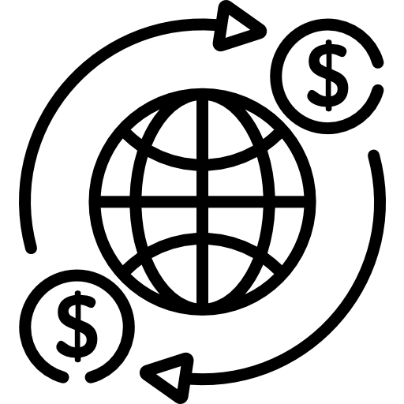

# Basic Banking System - Complete Project Explanation

## Table of Contents
1. [Project Overview](#project-overview)
2. [Technologies Used](#technologies-used)
3. [Project Structure](#project-structure)
4. [Database Architecture](#database-architecture)
5. [File-by-File Explanation](#file-by-file-explanation)
6. [How the System Works](#how-the-system-works)
7. [Setup Instructions](#setup-instructions)
8. [User Journey](#user-journey)
9. [Key Features](#key-features)
10. [Code Flow Explanation](#code-flow-explanation)

---

## Project Overview

The **Basic Banking System** is a simple web-based application that simulates core banking operations. It allows users to:
- View customer accounts and their balances
- Transfer money between customer accounts
- View complete transaction history
- Track all banking activities in real-time

This project is perfect for beginners learning web development as it demonstrates:
- Frontend design with HTML, CSS, and JavaScript
- Backend programming with PHP
- Database management with MySQL
- Full-stack integration

**Live Demo**: http://parthpatel.epizy.com/

---

## Technologies Used

### Frontend Technologies
1. **HTML5**: Structure of web pages
2. **CSS3**: Styling and layout
3. **JavaScript**: Client-side interactivity and navigation
4. **Boxicons**: Icon library for visual elements
5. **Google Fonts**: Custom typography (Montserrat & Overpass)

### Backend Technologies
1. **PHP**: Server-side scripting language
2. **MySQL**: Relational database management system
3. **MySQLi**: PHP extension for database operations

### Development Approach
- **Architecture**: Client-Server Model
- **Pattern**: MVC-like structure (simplified)
- **Responsive Design**: Mobile-friendly interface

---

## Project Structure

```
basic-banking-system/
│
├── index.php                    # Homepage/Landing page
├── customers.php                # Customer list and accounts view
├── transaction.php              # Money transfer interface
├── transactionHistory.php       # Transaction history display
├── db.php                       # Database connection configuration
├── readme.md                    # Project readme
│
├── css/
│   ├── style.css               # Main stylesheet for homepage
│   ├── table.css               # Styles for tables
│   ├── transaction.css         # Styles for transaction page
│   └── responsive.css          # Mobile responsive styles
│
└── images/
    ├── bg.jpg                  # Background images
    ├── mnbg.jpg, mnbg1.jpg, mnbg2.jpg
    ├── people.png              # Customer icon
    └── transaction.png         # Transaction icon
```

---

## Database Architecture

The system uses a MySQL database named **`epiz_29459070_dbsytem`** with two main tables:

### 1. `customers` Table
Stores information about all bank customers.

**Schema:**
```sql
CREATE TABLE customers (
    ID INT PRIMARY KEY AUTO_INCREMENT,
    NAME VARCHAR(255) NOT NULL,
    EMAIL VARCHAR(255) NOT NULL,
    CB DECIMAL(10, 2) NOT NULL  -- Current Balance
);
```

**Fields:**
- `ID`: Unique customer account number (auto-incremented)
- `NAME`: Customer's full name
- `EMAIL`: Customer's email address
- `CB`: Current Balance (in currency)

**Sample Data:**
```
ID  | NAME           | EMAIL                    | CB
----|----------------|--------------------------|--------
1   | John Doe       | john@example.com         | 50000
2   | Jane Smith     | jane@example.com         | 35000
3   | Bob Johnson    | bob@example.com          | 42000
```

### 2. `transaction` Table
Records all money transfers between customers.

**Schema:**
```sql
CREATE TABLE transaction (
    ID INT PRIMARY KEY AUTO_INCREMENT,
    SENDER VARCHAR(255) NOT NULL,
    RECEIVER VARCHAR(255) NOT NULL,
    AMOUNT DECIMAL(10, 2) NOT NULL,
    DATE-TIME TIMESTAMP DEFAULT CURRENT_TIMESTAMP
);
```

**Fields:**
- `ID`: Unique transaction ID
- `SENDER`: Name of the customer sending money
- `RECEIVER`: Name of the customer receiving money
- `AMOUNT`: Amount transferred
- `DATE-TIME`: Timestamp of transaction

**Sample Data:**
```
ID | SENDER      | RECEIVER     | AMOUNT | DATE-TIME
---|-------------|--------------|--------|-------------------
1  | John Doe    | Jane Smith   | 5000   | 2024-01-15 10:30:00
2  | Jane Smith  | Bob Johnson  | 2000   | 2024-01-15 11:45:00
```

---

## File-by-File Explanation

### 1. `db.php` - Database Connection File

**Purpose**: Establishes connection with the MySQL database.

```php
<?php 
$server = "sql306.epizy.com";        // Database server address
$username ="epiz_29459070";          // Database username
$password = "CjjLGNHzXGu3bQa";       // Database password
$db = "epiz_29459070_dbsytem";       // Database name

// Create connection
$con = mysqli_connect($server, $username, $password, $db);

// Check if connection was successful
if(!$con){
    die("Connection to this database failed due to" . mysqli_connect_error());
}
?>
```

**How it works:**
1. Defines database credentials
2. Uses `mysqli_connect()` to establish connection
3. Stores connection in `$con` variable
4. Dies with error message if connection fails
5. This file is included in all other PHP files using `include 'db.php';`

---

### 2. `index.php` - Homepage

**Purpose**: The landing page that welcomes users and provides navigation.

**Key Components:**

#### Header Section
```html
<header class="navbar">
    <div class="logo">
        <p><i class='bx bxs-bank'></i> TSF Bank <i class='bx bxs-bank'></i></p>
    </div>
    <ul class="item">
        <li><a href="#homePage">Home</a></li>
        <li><a href="#services">Services</a></li>
        <li><a href="customers.php">Customers</a></li>
        <li><a href="transactionHistory.php">Transaction History</a></li>
    </ul>
</header>
```
- Fixed navigation bar with bank logo
- Navigation links to different pages
- Sticky behavior (stays at top when scrolling)

#### Main Content
```html
<section class="main">
    <div class="content">
        <h1>Welcome To The TSF Multi-National Bank</h1>
        <p>An Online Bank Management System...</p>
        <button id="customers">View All Customers</button>
    </div>
</section>
```
- Welcome message
- Brief description
- Call-to-action button

#### Services Section
```html
<section id="services">
    <h3>Our Services</h3>
    <div class="card">
        <div class="card_content">
            
            <button id="customersPage">Our Customers</button>
        </div>
        <div class="card_content">
            
            <button id="transactionPage">Our Transaction Logs</button>
        </div>
    </div>
</section>
```
- Displays service cards
- Navigation buttons with icons

#### JavaScript Navigation
```javascript
document.getElementById("customers").onclick = function () {
    location.href = "customers.php";
};
```
- Handles button clicks
- Redirects to appropriate pages
- Adds sticky navbar effect on scroll

---

### 3. `customers.php` - Customer List Page

**Purpose**: Displays all customers with their account details and allows money transfer.

**Key Components:**

#### Database Query
```php
<?php 
include 'db.php';  // Include database connection

$selectquery = "select * from customers";
$query = mysqli_query($con, $selectquery);
$rownum = mysqli_num_rows($query);
?>
```
- Includes database connection
- Fetches all customer records
- Stores results in `$query` variable

#### Dynamic Table Generation
```php
<table class="main-table">
    <thead>
        <tr>
            <th>Ac. No.</th>
            <th>Name</th>
            <th>Email</th>
            <th>Current Balance</th>
            <th>Transfer</th>
        </tr>
    </thead>
    <tbody>
    <?php 
        while($res = mysqli_fetch_array($query)){
    ?>
        <tr>
            <td><?php echo $res['ID'] ?></td>
            <td><?php echo $res['NAME'] ?></td>
            <td><?php echo $res['EMAIL'] ?></td>
            <td><?php echo $res['CB'] ?></td>
            <td>
                <button class="transferbtn">
                    <a href="transaction.php?ID=<?php echo $res['ID'] ?>">
                        Transfer Money
                    </a>
                </button>
            </td>
        </tr>
    <?php } ?>
    </tbody>
</table>
```

**How it works:**
1. Creates table header with column names
2. Loops through each customer record using `while` loop
3. For each customer:
   - Displays ID, name, email, and current balance
   - Creates a "Transfer Money" button
   - Button links to `transaction.php` with customer ID as parameter
4. `mysqli_fetch_array($query)` retrieves one row at a time

---

### 4. `transaction.php` - Money Transfer Page

**Purpose**: Handles money transfers between customers.

**Key Components:**

#### Get Sender Information
```php
<?php
include 'db.php';

$customerId = $_GET['ID'];  // Get customer ID from URL
$selectquery = "SELECT * FROM customers WHERE ID = '$customerId'";
$showdata = mysqli_query($con, $selectquery);

if ($bool = mysqli_fetch_array($showdata)) {
    $money = $bool['CB'];        // Sender's current balance
    $sender = $bool['NAME'];     // Sender's name
}
?>
```
- Retrieves customer ID from URL parameter
- Fetches sender's details from database
- Stores balance and name for validation

#### Transfer Form
```php
<form action="" method="post">
    <table class="table">
        <tr>
            <td>Transfer From:</td>
            <td><?php echo $sender . '(' . $bool['CB'] . ')'; ?></td>
        </tr>
        <tr>
            <td>Transfer To:</td>
            <td>
                <select name="customers">
                    <?php
                    $selectquery = "SELECT NAME,CB FROM customers WHERE NOT ID = '$customerId'";
                    $showdata = mysqli_query($con, $selectquery);
                    
                    while ($transferTo = mysqli_fetch_array($showdata)) {
                        echo "<option value='{$transferTo['NAME']}'>";
                        echo "{$transferTo['NAME']} ({$transferTo['CB']})";
                        echo "</option>";
                    }
                    ?>
                </select>
            </td>
        </tr>
        <tr>
            <td>Enter Amount:</td>
            <td>
                <input type="number" name="amount" required 
                       min="1" max="<?php echo $money; ?>">
            </td>
        </tr>
    </table>
    <button type="submit">Transfer</button>
</form>
```

**Form Features:**
1. **Transfer From**: Shows sender's name and current balance
2. **Transfer To**: Dropdown with all other customers (excluding sender)
3. **Amount Input**: 
   - Number input field
   - Minimum value: 1
   - Maximum value: Sender's current balance (prevents overdraft)
   - Required field

#### Processing Transaction
```php
<?php
if (!empty($_POST['amount'])) {
    $transfer = $_POST['amount'];      // Amount to transfer
    $receiver = $_POST['customers'];   // Receiver's name
    
    // Calculate new balance for sender
    $amount = $money - $transfer;
    
    // Get receiver's current balance
    $getMoneyQuery = "SELECT `CB` FROM `customers` WHERE `NAME` = '$receiver'";
    $getMoney = mysqli_query($con, $getMoneyQuery);
    
    if ($amt = mysqli_fetch_array($getMoney)) {
        $addmoney = $amt[0] + $transfer;  // Calculate new balance for receiver
    }
    
    // Update sender's balance
    $updatequery = "UPDATE `customers` SET `CB` = '$amount' WHERE `ID` = '$customerId'";
    $update = mysqli_query($con, $updatequery);
    
    // Update receiver's balance
    $updateToQuery = "UPDATE `customers` SET `CB` = '$addmoney' WHERE `NAME` = '$receiver'";
    $updateTo = mysqli_query($con, $updateToQuery);
    
    // Record transaction in history
    $TransactionHistoryQuery = "INSERT INTO `transaction` 
        (`SENDER`, `RECEIVER`, `AMOUNT`, `DATE-TIME`) 
        VALUES ('$sender','$receiver','$transfer', current_timestamp());";
    $TransactionHistory = mysqli_query($con, $TransactionHistoryQuery);
}

if ($update) {
    echo "<script>
        alert('Transaction Successful');
        window.location.href = 'transactionHistory.php';
    </script>";
}
?>
```

**Transaction Process:**
1. Checks if form is submitted (amount field not empty)
2. Retrieves transfer amount and receiver name
3. Calculates sender's new balance (current - transfer)
4. Fetches receiver's current balance from database
5. Calculates receiver's new balance (current + transfer)
6. Updates sender's balance in database
7. Updates receiver's balance in database
8. Inserts transaction record with timestamp
9. Shows success alert and redirects to transaction history

**Important Notes:**
- All database operations happen in sequence
- Transaction is atomic (all or nothing)
- Timestamp is auto-generated using `current_timestamp()`

---

### 5. `transactionHistory.php` - Transaction History Page

**Purpose**: Displays all past transactions in chronological order.

**Key Components:**

#### Fetch Transaction Data
```php
<?php
include 'db.php';

$selectquery = "select * from transaction";
$query = mysqli_query($con, $selectquery);
$rownum = mysqli_num_rows($query);
?>
```
- Fetches all records from transaction table
- No filtering applied (shows complete history)

#### Display Transaction Table
```php
<table class="main-table">
    <thead>
        <tr>
            <th>ID</th>
            <th>Sender</th>
            <th>Receiver</th>
            <th>Amount</th>
            <th>Date and Time</th>
        </tr>
    </thead>
    <tbody>
        <?php
        while ($res = mysqli_fetch_array($query)) {
        ?>
            <tr>
                <td><?php echo $res['ID'] ?></td>
                <td><?php echo $res['SENDER'] ?></td>
                <td><?php echo $res['RECEIVER'] ?></td>
                <td><?php echo $res['AMOUNT'] ?></td>
                <td><?php echo $res['DATE-TIME'] ?></td>
            </tr>
        <?php } ?>
    </tbody>
</table>
```

**How it works:**
1. Creates table with 5 columns
2. Loops through all transaction records
3. Displays each transaction in a row
4. Shows complete transaction details including timestamp

---

## CSS Files Explained

### 1. `style.css` - Main Stylesheet

**Key Styles:**

#### Universal Reset
```css
* { 
    text-decoration: none;
    margin: 0;
    padding: 0;
    font-family: 'Montserrat', sans-serif;
    box-sizing: border-box;
}
```
- Removes default browser styling
- Sets consistent font family
- Box-sizing for better layout control

#### Navigation Bar
```css
.navbar {
    position: fixed;
    top: 0;
    left: 0;
    width: 100%;
    padding: 40px 100px;
    background: #1E2022;
    transition: 0.6s;
}

.navbar.sticky {
    padding: 5px 100px;
    background: #282828;
}
```
- Fixed positioning (stays at top)
- Dark background color
- Smooth transition effect
- Changes style when scrolling (sticky class)

#### Logo Styling
```css
.logo {
    font-weight: 700;
    color: #1E2022;
    background-color: #F7F7F7;
    font-size: 2rem;
    text-transform: uppercase;
    letter-spacing: 2px;
}

.logo:hover {
    background-color: #1E2022;
    color: #F7F7F7;
}
```
- Bold, uppercase text
- Light background with dark text
- Inverted colors on hover
- Wide letter spacing for readability

#### Navigation Items
```css
.item li a {
    color: #F7F7F7;
    letter-spacing: 2px;
    font-weight: 500px;  /* NOTE: Should be '500' (no unit) */
    transition: 0.6s;
}

.item li a:hover {
    padding: 9px 14px;
    background-color: #F7F7F7;
    color: #1E2022;
}
```
- Light text color
- Smooth hover effect
- Background changes on hover

**Note**: The `font-weight: 500px;` has an error - font-weight should not have units. It should be `font-weight: 500;` (unitless number) or a keyword like `bold`, `normal`, etc.

#### Buttons
```css
.btn {
    padding: 10px 20px;
    font-size: 16px;
    font-weight: bold;
    background-color: #555555;
    color: #F7F7F7;
}

.btn:hover {
    background-color: #333333;
    transform: scale(0.25rem);  /* NOTE: Should be scale(1.05) or similar unitless number */
    transition: 0.5s;
}
```
- Consistent padding and sizing
- Dark background with light text
- Darker shade on hover with scale effect

**Note**: The `transform: scale(0.25rem);` has an error - scale() expects a unitless number. It should be something like `scale(1.05)` for 5% enlargement or `scale(0.95)` for 5% reduction.

### 2. `table.css` - Table Styling

**Key Features:**

```css
.main-table {
    border-collapse: collapse;
    margin: 50px auto;
    width: 75%;
    box-shadow: 0 0 20px rgba(0, 0, 0, 0.055);
}

.main-table thead tr {
    background-color: #888888;
    color: #F7F7F7;
}

.main-table tbody tr:nth-of-type(even) {
    background-color: #C0C0C0;
}

.main-table tbody tr:hover {
    background-color: #C0C0C0;
    color: #F7F7F7;
}
```
- Centered table with shadow
- Gray header with white text
- Alternating row colors (zebra striping)
- Hover effect on rows for better UX

### 3. `transaction.css` - Transaction Page Styling

```css
html::before {
    content: "";
    background: url(../images/mnbg1.jpg) no-repeat center /cover;
    height: 100%;
    width: 100%;
    position: absolute;
    z-index: -1;
}

.mainSection {
    margin: 30px auto;
    width: 50%;
    border: 1px solid;
    background-color: #f7f7f7;
}

.input {
    border: none;
    padding: 5px;
    box-shadow: 2px 2px 1px black;
    color: gray;
}
```
- Full-page background image
- Centered form container
- Styled input fields with shadow

### 4. `responsive.css` - Mobile Responsive Styles

```css
@media only screen and (max-width: 768px) {
    .navbar {
        height: 200px;
        flex-direction: column;
    }
    
    .card {
        flex-direction: column;
    }
    
    .card_content {
        width: 75%;
    }
    
    .main-table thead tr th:nth-child(3),
    .main-table tbody tr td:nth-child(3) {
        display: none;  /* Hide email column on mobile */
    }
}
```
- Applies to screens smaller than 768px
- Stacks navbar items vertically
- Stacks service cards
- Hides email column in tables to save space

---

## How the System Works

### Complete System Flow

```
┌─────────────────────────────────────────────────────────────┐
│                         User Opens Website                   │
│                         (index.php)                          │
└────────────────────────┬────────────────────────────────────┘
                         │
                         ▼
┌─────────────────────────────────────────────────────────────┐
│  Homepage displays:                                          │
│  - Welcome message                                           │
│  - Service cards                                             │
│  - Navigation buttons                                        │
└────────────────────────┬────────────────────────────────────┘
                         │
        ┌────────────────┼────────────────┐
        │                │                │
        ▼                ▼                ▼
    View All       Transaction      Click any
    Customers        History         button
        │                │                │
        ▼                ▼                │
┌───────────────┐  ┌────────────────┐   │
│ customers.php │  │ transaction    │   │
│               │  │ History.php    │   │
└───────┬───────┘  └────────────────┘   │
        │                                 │
        ▼                                 │
┌─────────────────────────────────────┐  │
│ Display all customers in table:      │  │
│ - Account number                      │  │
│ - Name                                │  │
│ - Email                               │  │
│ - Current balance                     │  │
│ - Transfer button for each customer   │  │
└───────────┬─────────────────────────┘  │
            │                             │
            ▼                             │
    Click "Transfer Money"                │
            │                             │
            ▼                             │
┌──────────────────────────────────────┐ │
│ transaction.php?ID=X                  │ │
│                                       │ │
│ 1. Get sender details (ID from URL)  │ │
│ 2. Display sender name & balance     │ │
│ 3. Show dropdown of other customers  │ │
│ 4. Input field for amount            │ │
│ 5. Submit button                      │ │
└───────────┬──────────────────────────┘ │
            │                             │
            ▼                             │
    User fills form and submits          │
            │                             │
            ▼                             │
┌──────────────────────────────────────┐ │
│ Process Transaction:                  │ │
│                                       │ │
│ 1. Validate amount                   │ │
│ 2. Deduct from sender balance        │ │
│ 3. Add to receiver balance           │ │
│ 4. Update both records in DB         │ │
│ 5. Insert transaction record         │ │
│ 6. Show success alert                │ │
└───────────┬──────────────────────────┘ │
            │                             │
            ▼                             │
    Redirect to Transaction History      │
            │                             │
            └─────────────────────────────┘
                         │
                         ▼
┌─────────────────────────────────────────┐
│ transactionHistory.php                   │
│                                          │
│ Display all transactions:                │
│ - Transaction ID                         │
│ - Sender name                            │
│ - Receiver name                          │
│ - Amount transferred                     │
│ - Date and time                          │
└──────────────────────────────────────────┘
```

---

## Setup Instructions

### Prerequisites
1. **Web Server**: Apache (XAMPP, WAMP, or LAMP)
2. **PHP**: Version 7.0 or higher
3. **MySQL**: Version 5.6 or higher
4. **Web Browser**: Any modern browser (Chrome, Firefox, Safari, Edge)

### Installation Steps

#### Step 1: Download and Install XAMPP
1. Download XAMPP from https://www.apachefriends.org/
2. Install XAMPP on your computer
3. Start Apache and MySQL services from XAMPP Control Panel

#### Step 2: Clone the Project
```bash
# Clone the repository
git clone https://github.com/parthkishan20/basic-banking-system.git

# Or download ZIP and extract
```

#### Step 3: Setup Project Files
1. Copy the project folder to XAMPP's `htdocs` directory
   - Windows: `C:/xampp/htdocs/basic-banking-system/`
   - Linux: `/opt/lampp/htdocs/basic-banking-system/`
   - Mac: `/Applications/XAMPP/htdocs/basic-banking-system/`

#### Step 4: Create Database
1. Open web browser and go to `http://localhost/phpmyadmin/`
2. Click on "New" to create a new database
3. Name it: `banking_system` (or any name you prefer)
4. Click "Create"

#### Step 5: Create Tables

**Create `customers` table:**
```sql
CREATE TABLE customers (
    ID INT PRIMARY KEY AUTO_INCREMENT,
    NAME VARCHAR(255) NOT NULL,
    EMAIL VARCHAR(255) NOT NULL,
    CB DECIMAL(10, 2) NOT NULL DEFAULT 0
);
```

**Create `transaction` table:**
```sql
CREATE TABLE transaction (
    ID INT PRIMARY KEY AUTO_INCREMENT,
    SENDER VARCHAR(255) NOT NULL,
    RECEIVER VARCHAR(255) NOT NULL,
    AMOUNT DECIMAL(10, 2) NOT NULL,
    `DATE-TIME` TIMESTAMP DEFAULT CURRENT_TIMESTAMP
);
```

#### Step 6: Add Sample Data

**Insert sample customers:**
```sql
INSERT INTO customers (NAME, EMAIL, CB) VALUES
('John Doe', 'john@example.com', 50000),
('Jane Smith', 'jane@example.com', 35000),
('Bob Johnson', 'bob@example.com', 42000),
('Alice Williams', 'alice@example.com', 28000),
('Charlie Brown', 'charlie@example.com', 65000),
('Diana Prince', 'diana@example.com', 45000),
('Ethan Hunt', 'ethan@example.com', 38000),
('Fiona Green', 'fiona@example.com', 52000),
('George Miller', 'george@example.com', 31000),
('Helen Davis', 'helen@example.com', 48000);
```

#### Step 7: Update Database Connection
1. Open `db.php` file
2. Update the database credentials:
```php
<?php 
$server = "localhost";           // Database server
$username = "root";              // MySQL username (default: root)
$password = "";                  // MySQL password (default: empty)
$db = "banking_system";          // Your database name

$con = mysqli_connect($server, $username, $password, $db);

if(!$con){
    die("Connection failed: " . mysqli_connect_error());
}
?>
```

#### Step 8: Run the Application
1. Open web browser
2. Navigate to: `http://localhost/basic-banking-system/index.php`
3. The homepage should load successfully

### Troubleshooting Common Issues

**Issue 1: Database connection error**
- Solution: Check if MySQL is running in XAMPP
- Verify database name, username, and password in `db.php`

**Issue 2: Page not found (404)**
- Solution: Ensure project is in `htdocs` folder
- Check if Apache is running
- Verify the URL path

**Issue 3: CSS not loading**
- Solution: Check file paths in HTML
- Ensure all CSS files are in the `css/` folder
- Clear browser cache

**Issue 4: Images not displaying**
- Solution: Verify images are in the `images/` folder
- Check file names and extensions
- Ensure correct file paths in HTML/CSS

---

## User Journey

### Scenario: John wants to transfer money to Jane

#### Step 1: Landing Page
- John opens the website
- Sees welcome message and bank services
- Clicks "View All Customers" button

#### Step 2: Customer List
- System shows table with all customers
- John sees:
  ```
  Ac. No. | Name      | Email             | Current Balance | Transfer
  1       | John Doe  | john@example.com  | 50000          | [Transfer Money]
  2       | Jane Smith| jane@example.com  | 35000          | [Transfer Money]
  ```
- John clicks "Transfer Money" button next to his name

#### Step 3: Transaction Page
- System loads transaction page with John's ID
- Page shows:
  - **Transfer From**: John Doe (50000)
  - **Transfer To**: Dropdown list of other customers
  - **Amount**: Input field
- John selects "Jane Smith" from dropdown
- John enters amount: 5000
- John clicks "Transfer" button

#### Step 4: Processing
Behind the scenes:
1. System validates amount (5000 ≤ 50000) ✓
2. Calculates John's new balance: 50000 - 5000 = 45000
3. Calculates Jane's new balance: 35000 + 5000 = 40000
4. Updates John's balance to 45000 in database
5. Updates Jane's balance to 40000 in database
6. Inserts transaction record:
   ```
   SENDER: John Doe
   RECEIVER: Jane Smith
   AMOUNT: 5000
   DATE-TIME: 2024-01-15 14:30:00
   ```

#### Step 5: Confirmation
- Alert box shows: "Transaction Successful"
- John clicks "OK"
- System redirects to Transaction History page

#### Step 6: Transaction History
- John sees complete transaction history
- Latest transaction appears at the bottom:
  ```
  ID | Sender    | Receiver    | Amount | Date and Time
  1  | John Doe  | Jane Smith  | 5000   | 2024-01-15 14:30:00
  ```

#### Step 7: Verification
- John can click "View Customers" again
- Verify updated balances:
  ```
  Ac. No. | Name       | Current Balance
  1       | John Doe   | 45000  (was 50000)
  2       | Jane Smith | 40000  (was 35000)
  ```

---

## Key Features

### 1. **User-Friendly Interface**
- Clean and modern design
- Intuitive navigation
- Responsive layout for all devices
- Visual feedback on interactions

### 2. **Real-Time Balance Updates**
- Balances update immediately after transfer
- Both sender and receiver balances adjusted
- No manual refresh needed

### 3. **Complete Transaction History**
- All transactions recorded permanently
- Timestamp for each transaction
- Easy to track money flow

### 4. **Data Validation**
- Amount cannot exceed sender's balance
- Minimum transfer amount: 1
- Required fields must be filled
- Cannot transfer to self

### 5. **Secure Database Operations**
- MySQLi prepared for database queries
- Server-side validation
- Error handling for failed connections

### 6. **Responsive Design**
- Works on desktop, tablet, and mobile
- Adaptive layout for different screen sizes
- Hidden elements on small screens for better UX

### 7. **Visual Feedback**
- Alert messages for successful transactions
- Hover effects on buttons and links
- Sticky navigation bar
- Color-coded table rows

---

## Code Flow Explanation

### Customer Viewing Flow

```php
// customers.php

// Step 1: Include database connection
include 'db.php';

// Step 2: Prepare SQL query to fetch all customers
$selectquery = "select * from customers";

// Step 3: Execute query
$query = mysqli_query($con, $selectquery);

// Step 4: Loop through results
while($res = mysqli_fetch_array($query)){
    // Step 5: Display each customer's data
    echo $res['ID'];
    echo $res['NAME'];
    echo $res['EMAIL'];
    echo $res['CB'];
}
```

**Explanation:**
1. **Database Connection**: `include 'db.php'` loads database connection
2. **Query Preparation**: SQL query string is created
3. **Query Execution**: `mysqli_query()` sends query to database
4. **Result Processing**: `mysqli_fetch_array()` retrieves one row at a time
5. **Data Display**: Each field is echoed in table cells
6. **Loop Continuation**: Continues until all rows are processed

### Money Transfer Flow

```php
// transaction.php

// PHASE 1: Display Form
// Get sender information
$customerId = $_GET['ID'];
$selectquery = "SELECT * FROM customers WHERE ID = '$customerId'";
$showdata = mysqli_query($con, $selectquery);
$bool = mysqli_fetch_array($showdata);
$sender = $bool['NAME'];
$money = $bool['CB'];

// PHASE 2: Process Submission
if (!empty($_POST['amount'])) {
    // Get form data
    $transfer = $_POST['amount'];
    $receiver = $_POST['customers'];
    
    // Calculate new balances
    $senderNewBalance = $money - $transfer;
    
    // Get receiver's current balance
    $getMoneyQuery = "SELECT `CB` FROM `customers` WHERE `NAME` = '$receiver'";
    $getMoney = mysqli_query($con, $getMoneyQuery);
    $amt = mysqli_fetch_array($getMoney);
    $receiverNewBalance = $amt[0] + $transfer;
    
    // Update sender's balance
    $updateSender = "UPDATE `customers` SET `CB` = '$senderNewBalance' WHERE `ID` = '$customerId'";
    mysqli_query($con, $updateSender);
    
    // Update receiver's balance
    $updateReceiver = "UPDATE `customers` SET `CB` = '$receiverNewBalance' WHERE `NAME` = '$receiver'";
    mysqli_query($con, $updateReceiver);
    
    // Record transaction
    $recordTransaction = "INSERT INTO `transaction` (`SENDER`, `RECEIVER`, `AMOUNT`) 
                         VALUES ('$sender','$receiver','$transfer')";
    mysqli_query($con, $recordTransaction);
    
    // Redirect
    echo "<script>alert('Success'); window.location.href='transactionHistory.php';</script>";
}
```

**Step-by-Step Breakdown:**

**Phase 1: Form Display**
1. Get customer ID from URL parameter
2. Query database for sender's details
3. Store sender's name and balance
4. Display form with:
   - Sender info (read-only)
   - Receiver dropdown (other customers)
   - Amount input (max = sender's balance)

**Phase 2: Form Submission**
1. Check if form is submitted (amount field not empty)
2. Get transfer amount and receiver name from POST data
3. Calculate sender's new balance (subtract transfer amount)
4. Query database for receiver's current balance
5. Calculate receiver's new balance (add transfer amount)
6. Execute UPDATE query for sender
7. Execute UPDATE query for receiver
8. Execute INSERT query for transaction record
9. Show success alert using JavaScript
10. Redirect to transaction history page

### Database Query Patterns

#### SELECT Query (Reading Data)
```php
// Pattern
$query = "SELECT column1, column2 FROM table WHERE condition";
$result = mysqli_query($connection, $query);
$data = mysqli_fetch_array($result);
```

**Example:**
```php
$query = "SELECT NAME, CB FROM customers WHERE ID = '5'";
$result = mysqli_query($con, $query);
$row = mysqli_fetch_array($result);
echo $row['NAME'];  // Displays customer name
echo $row['CB'];    // Displays balance
```

#### UPDATE Query (Modifying Data)
```php
// Pattern
$query = "UPDATE table SET column1 = 'value1' WHERE condition";
$result = mysqli_query($connection, $query);
```

**Example:**
```php
$newBalance = 45000;
$customerId = 5;
$query = "UPDATE customers SET CB = '$newBalance' WHERE ID = '$customerId'";
mysqli_query($con, $query);
```

#### INSERT Query (Adding Data)
```php
// Pattern
$query = "INSERT INTO table (column1, column2) VALUES ('value1', 'value2')";
$result = mysqli_query($connection, $query);
```

**Example:**
```php
$query = "INSERT INTO transaction (SENDER, RECEIVER, AMOUNT) 
          VALUES ('John Doe', 'Jane Smith', '5000')";
mysqli_query($con, $query);
```

---

## Security Considerations

### Current Implementation
The current system is designed for learning purposes and has some security considerations:

#### SQL Injection Vulnerability
**Current Code:**
```php
$customerId = $_GET['ID'];
$query = "SELECT * FROM customers WHERE ID = '$customerId'";
```

**Issue**: Direct use of user input in SQL queries
**Risk**: Malicious users could inject SQL code

**Better Approach (for production):**
```php
$customerId = mysqli_real_escape_string($con, $_GET['ID']);
$query = "SELECT * FROM customers WHERE ID = '$customerId'";

// OR use prepared statements
$stmt = mysqli_prepare($con, "SELECT * FROM customers WHERE ID = ?");
mysqli_stmt_bind_param($stmt, "i", $customerId);
mysqli_stmt_execute($stmt);
```

#### Password Storage
- Current system has no authentication
- Passwords should be hashed (bcrypt, argon2)
- Sessions should be used for user authentication

#### Best Practices for Production
1. **Use Prepared Statements**: Prevent SQL injection
2. **Input Validation**: Validate all user inputs
3. **Session Management**: Implement user authentication
4. **HTTPS**: Use SSL/TLS for secure communication
5. **Error Handling**: Don't expose database errors to users
6. **Access Control**: Limit who can transfer money
7. **Transaction Limits**: Set maximum transfer amounts
8. **Logging**: Record all transactions and access attempts

---

## Technologies Deep Dive

### PHP (Hypertext Preprocessor)
**What it is**: Server-side scripting language
**Purpose**: Processes data, interacts with database, generates dynamic HTML
**Key Functions Used**:
- `mysqli_connect()`: Connect to database
- `mysqli_query()`: Execute SQL queries
- `mysqli_fetch_array()`: Retrieve query results
- `include`: Include other PHP files
- `$_GET`: Access URL parameters
- `$_POST`: Access form data

### MySQL (Database)
**What it is**: Relational database management system
**Purpose**: Store customer data and transaction records
**Key Features**:
- Tables with defined columns and data types
- Primary keys for unique identification
- AUTO_INCREMENT for automatic ID generation
- TIMESTAMP for automatic date/time recording

### HTML5 (Structure)
**What it is**: Markup language for web pages
**Purpose**: Define structure and content
**Key Elements Used**:
- `<table>`: Display data in tabular format
- `<form>`: Collect user input
- `<input>`: Input fields for data entry
- `<select>`: Dropdown menus
- `<button>`: Action buttons

### CSS3 (Styling)
**What it is**: Style sheet language
**Purpose**: Control visual presentation
**Key Features Used**:
- Flexbox: Flexible layouts
- Transitions: Smooth animations
- Hover effects: Interactive feedback
- Media queries: Responsive design
- Box shadows: Visual depth

### JavaScript (Interactivity)
**What it is**: Client-side scripting language
**Purpose**: Add dynamic behavior
**Key Features Used**:
- Event listeners: Respond to user actions
- DOM manipulation: Change page elements
- Window object: Redirect pages, show alerts
- Scroll events: Sticky navigation

---

## Learning Outcomes

By studying this project, beginners will learn:

### Frontend Development
1. Creating responsive web layouts
2. Styling tables and forms
3. Implementing navigation systems
4. Using external libraries (Boxicons, Google Fonts)
5. Mobile-first design principles

### Backend Development
1. Connecting PHP to MySQL database
2. Executing SQL queries from PHP
3. Processing form data
4. Handling GET and POST requests
5. Redirecting between pages

### Database Management
1. Designing database schemas
2. Creating tables with proper data types
3. Writing SELECT, UPDATE, and INSERT queries
4. Using AUTO_INCREMENT and TIMESTAMP
5. Managing relationships between tables

### Full-Stack Integration
1. Connecting frontend forms to backend processing
2. Displaying database data in HTML
3. Real-time data updates
4. Transaction management
5. Error handling

### Best Practices
1. Code organization and structure
2. Separation of concerns (CSS, JS, PHP)
3. Consistent naming conventions
4. Comments and documentation
5. Responsive design patterns

---

## Future Enhancements

Possible improvements for advanced learning:

### Authentication System
- User login/logout functionality
- Password hashing and verification
- Session management
- Role-based access control

### Enhanced Security
- Prepared statements for SQL
- Input sanitization
- CSRF protection
- XSS prevention

### Additional Features
- Account creation for new customers
- Password reset functionality
- Email notifications for transactions
- Transaction filtering and search
- PDF statement generation
- Multi-currency support

### UI/UX Improvements
- Dashboard with charts and graphs
- Real-time balance updates (AJAX)
- Transaction confirmation before processing
- Print-friendly transaction history
- Dark mode option

### Database Improvements
- Foreign keys for data integrity
- Indexes for faster queries
- Transaction rollback on errors
- Audit logs for all changes
- Backup and recovery procedures

### Code Quality
- Object-Oriented Programming (OOP) structure
- MVC architecture implementation
- PDO instead of MySQLi
- Error logging system
- Unit tests

---

## Conclusion

The **Basic Banking System** is an excellent project for beginners to learn full-stack web development. It demonstrates:

✅ **Frontend Skills**: HTML, CSS, JavaScript, responsive design
✅ **Backend Skills**: PHP, server-side processing, form handling
✅ **Database Skills**: MySQL, CRUD operations, data management
✅ **Integration**: Connecting all technologies together
✅ **Real-World Application**: Practical banking operations

This project provides a solid foundation for understanding how web applications work and serves as a stepping stone for more complex projects.

### Key Takeaways
1. **Database-driven applications** store and retrieve data dynamically
2. **PHP processes** user requests and interacts with databases
3. **HTML forms** collect user input
4. **CSS** creates professional, responsive interfaces
5. **JavaScript** enhances user experience with interactivity
6. **SQL queries** manipulate data in databases
7. **Full-stack development** requires knowledge of multiple technologies

### Next Steps for Learners
1. Set up the project locally
2. Study each file carefully
3. Modify and experiment with the code
4. Add new features (start small)
5. Research security best practices
6. Learn about MVC architecture
7. Explore modern frameworks (Laravel, React)

---

## Additional Resources

### Documentation
- **PHP**: https://www.php.net/docs.php
- **MySQL**: https://dev.mysql.com/doc/
- **HTML/CSS**: https://developer.mozilla.org/

### Learning Platforms
- **W3Schools**: https://www.w3schools.com/
- **PHP Tutorial**: https://www.phptutorial.net/
- **MySQL Tutorial**: https://www.mysqltutorial.org/

### Tools
- **XAMPP**: https://www.apachefriends.org/
- **Visual Studio Code**: https://code.visualstudio.com/
- **phpMyAdmin**: Included with XAMPP

### Community
- **Stack Overflow**: https://stackoverflow.com/
- **PHP Subreddit**: https://www.reddit.com/r/PHP/
- **GitHub**: Explore similar projects

---

## Credits

**Developer**: Parth Patel
**Project**: TSF Bank - Basic Banking System
**Year**: 2021
**Purpose**: Educational/Learning Project
**Live Demo**: http://parthpatel.epizy.com/

---

## License

This project is open-source and available for educational purposes. Feel free to learn from it, modify it, and use it as a reference for your own projects.

---

**End of Documentation**

This comprehensive guide covers every aspect of the Basic Banking System project. Whether you're a complete beginner or looking to understand the internals of a banking application, this document provides all the information you need to get started and learn effectively.

Happy Learning! 🎓💻🏦
